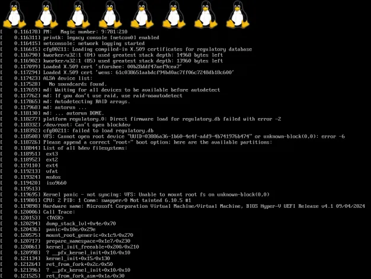
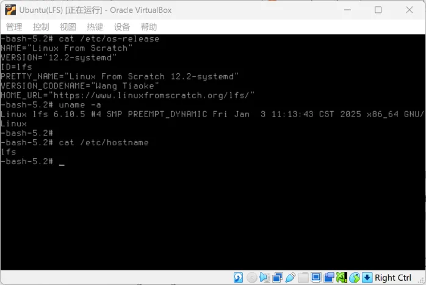

# Linux From Scratch 12.2 Systemd 留念



<br/>

Linux From Scratch 12.2 Systemd 总耗时约一周完结。写下这篇以作留念。

> **要始终把精力放在解决问题上面，不用自怨自艾。因为不管你关注不关注问题都是那个样子**
> ——《毛选》

我推荐使用 Hyper-V 来做 LFS，编译速度和真机差不多。推荐使用 Arch Linux Live-CD 或者 Ubuntu Live-CD（Ubuntu 可能需要略微调整）。

Windows 11 家庭版启用 Hyper-V 可以使用这个脚本： [Hyper-V.bat](./Hyper-V.bat)。

可以把 LFS 当作是从源码编译的 Arch Linux，基本上安装过程是一致的。

整体流程：创建一个虚拟机 BIOS 引导，一个硬盘 40G 添加 Live-CD 的 DVD，然后进行 LFS 分区，方案见下文。然后开始对着 LFS 的指令一步一步操作即可。

<details>
<summary>下载源码包的提示</summary>
在 Arch Linux 上，`mkfs.fat`  在 dosfstools 这个包里。

**LFS 网站阅读不是很方便**。阅读 PDF 和单 HTML 会更方便一点，点 LFS 后可以在左侧点击 Download 找到想要看的版本的离线版，HTML NOCHOUNK 版就比分页的阅读方便。

**LFS 的网站找东西不是很方便**。首页左侧的导航窗口有个 Website Mirros，这里有一个 Website Mirros 和 Files Mirrors，下载软件包一定要从镜像站去下载，不然很慢。

日本的镜像下载速度最快。

推荐下载这个源码包然后解压 https://repo.jing.rocks/lfs/lfs-packages/lfs-packages-12.2.tar
</details>

在 LFS 的学习过程中，遇到了一些问题，也解决了一些问题。我曾经尝试自己打一个 DEB 包（ Rust 写的网易云音乐），**_为什么 Rust 程序打包 DEB 的时候必须使用仓库里面的 Rust 来编译_**？

LFS 第八章中安装 Python 的一段介绍很好。因为 LFS 没有包管理器，直接用 root 用户使用 pip3 不会和包管理器冲突。而使用包管理器的 Linux 如果某个软件包依赖 python 库，为了这个软件包能正常安装依赖，就必须把依赖的 python 库页提供包管理的包。这里的考虑是既然 Linux 使用了包管理器就不应该使用编程语言提供的包管理器了，因为这可能会导致冲突。关于软件包的管理 LFS 中还有对各种解决方法更细节的介绍，但今天流行的发行版都采用了包管理器，而避免冲突就是使用软件仓库提供的包。所以通常开发的程序打包成 DEB 或者 RPM 就应该使用软件仓库的包来编译。

遇到的耗时最久的问题就是启动失败。_**就学习 Linux From Scratch 来说，采用什么样的分区方案最好呢**_？

LFS 编译的 GRUB 还不支持 UEFI，除非你很有信心能解决引导问题，如果只是学习的话使用 BIOS 引导就可以了（虚拟机不要启用 EFI）。推荐的分区方案：

```
sda
|--sda1 1M
|__sda2 40G /
```

没有使用 UEFI 模式就不需要 EFI 分区（ESP）,那就只分一个`/`分区。`sda1`是1M的Grub BIOS分区，不需要格式化，因为我使用了GUID 分区表 (GPT)，**这个分区不能格式化**，在安装启动引导器时必须能够被 GRUB 发现。这个**分区的类型是**`**BIOS Boot**`。

使用这个简单的分区方案也能直接使用 LFS 书上的 `grub.cfg`。如果使用 fdisk 来操作分区，`/dev/sda1`的开始扇区是`2048`，结束扇区是`4096`，刚好 `1M`。

_**有必要先安装一个 Linux 然后添加一个硬盘来安装 LFS 吗**_？

不管是学习还是真机安装，都可以直接启动一个 Ubuntu Live-CD 或者 Arch Linux 的 Live-CD。安装 LFS 应该主要是学习目的，使用虚拟机添加一个 40G 的硬盘，然后添加 Live-CD 的 DVD 就可以了。启动到 Live-CD 就可以开始进行分区，挂载对应的目录，然后下载源码开始编译。

_**网上说编译 glibc, gcc 要一个小时甚至几个小时有必要用真机来加速编译吗**_？

顺利的情况下，大概需要三天。主要是命令比较多，会不断地重复 `tar xf`，`configure`，`make`，`make install`。使用`Intel i5 14400`开 HyperV 二代虚拟机 4G 内存编译 gcc 可能也不超过 30 分钟，编译速度比想象中要快。想编译速度快可以直接使用 HyperV 虚拟机，第二代 HyperV 好像必须是 UEFI，所以引导启动这里不能解决 UEFI 的话，可以编译完了后按照第七章的备份和还原就能把编译好的 LFS 迁移到 VMware 或者 VirtualBox。不过备份是有一点慢的，可能需要 30 分钟甚至一个小时。

_**为什么推荐使用 BIOS 引导**_？

如果对 Linux 不是那么熟悉，引导失败可能会自己解决不了。第一次学习的话我就推荐使用 BIOS 引导，启动成功后自己可以备份 rootfs，重新建分区方案，做 UEFI 引导。可能需要参考 BLFS 自己重新生成一个 initramfs。